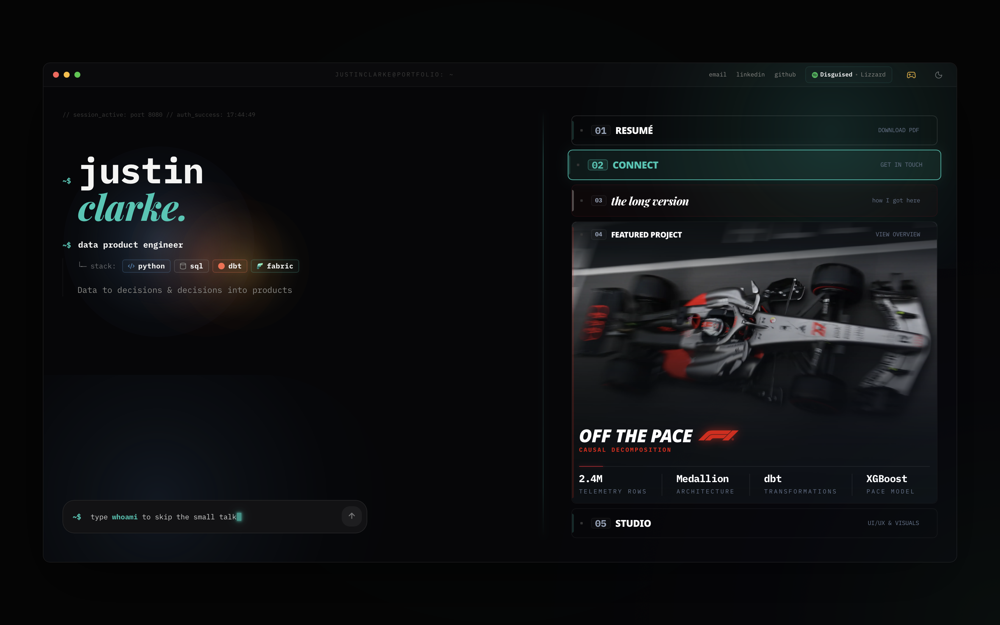

# Justin Clarke

> A portfolio you can type into, playable arcade games, an AI assistant that knows my resume, live Last.fm integration, and a causal-ML case study on Formula 1 strategy.



**Live →** [justinclarke.github.io](https://justinclarke.github.io)

```
React 19  ·  TypeScript 5.8 (strict)  ·  Tailwind CSS 4  ·  Framer Motion 12
```

---

## What's in here

**Terminal hero** the landing page is a working command-line interface. Pure TypeScript engine ([unit-tested](src/pages/home/Hero/engine.test.ts), zero React in the core), 15+ commands, fuzzy matching when you mistype, side effects that scroll the page, open modals, or launch one of couple arcade games (Snake, Pong, Tetris, Space Invaders). Type `help` to poke around.

**F1 pace analysis** a data engineering case study at [`/off-the-pace`](https://justinclarke.github.io/off-the-pace). FastF1 telemetry, dbt transformations, XGBoost modelling asking whether F1 pit stop calls were actually optimal. 2.4M rows through a medallion pipeline, with telemetry widgets and architecture deep-dive.

**AI assistant** the `ask` command streams answers from a Cloudflare Worker. Its system prompt is [compiled at build](scripts/build-system-prompt.mjs) from a YAML resume + persona file, and CI catches it if it goes stale. It's surprisingly good at answering questions about my background.

**Now Playing** Last.fm widget showing what I'm listening to. Updates live, not a static badge.

**Other bits** animated career timeline, dark/light theming, macOS-style command dock, spotlight cards, scroll reveals, preloader boot sequence. The kind of details you notice on a second visit :)

---

## Under the hood

A few things I'm particularly happy with:

- **Content layer** all identity, copy, and config lives in typed TS objects under `src/content/`. Fork the repo and you only edit data files, no digging through components.
- **Graceful degradation** Last.fm, analytics, AI chat, and the contact form are each `config | null`. Set any to `null` and the feature hides itself cleanly. A deployment with zero integrations still builds and passes tests.
- **CI gates** a Tailwind token contract (no raw hex, no text below 10px, no sub-AA contrast), route-table sync between code and docs, and prompt-freshness checks. They catch drift before I have to think about it.
- **Performance choices** `useMotionValue` instead of `setState` for per-frame animation, code-split per route, explicit icon imports (a wildcard once shipped ~150KB gz of unused icons).

---

## Quick start

```bash
git clone https://github.com/JustinClarke/justinclarke.github.io.git
cd justinclarke.github.io
npm install
npm run dev        # http://localhost:3000
```

| Command | What it does |
|:---|:---|
| `npm run dev` | Dev server (port 3000) |
| `npm run build` | `tsc` → Vite build → per-route metadata + sitemap |
| `npm run preview` | Serve the production build |
| `npm run lint` | Types + token gate + route/prompt sync + ESLint |
| `npm test` | Vitest (terminal engine, NowPlaying, AI agent, degradation) |
| `npm run build:prompt` | Regenerate the AI worker's system prompt |

Needs Node 24+. Deploys to GitHub Pages on push to `main` ([deploy.yml](.github/workflows/deploy.yml)); PRs gated by [ci.yml](.github/workflows/ci.yml).

---

## Stack

| Layer | Tech |
|:---|:---|
| Framework | React 19 |
| Language | TypeScript 5.8, `strict: true` |
| Styling | Tailwind CSS 4 (`@theme` tokens) |
| Animation | Framer Motion 12 |
| Routing | React Router 7 |
| Modals | Radix UI Dialog |
| SEO | react-helmet-async + build-time metadata |
| AI chat | Cloudflare Worker (optional) |
| Analytics | Umami, cookieless (optional) |
| Tests | Vitest 4 · ESLint 9 + custom gates |
| Bundler | Vite 6 |

---

## Use it as a template

The content layer makes this pretty easy to fork. Edit the data files, swap the assets, delete case studies you don't need. The compiler tells you what's left to fix.

See [_docs/template.md](_docs/template.md) for the full walkthrough.

---

## Docs

| Doc | Covers |
|:---|:---|
| [template.md](_docs/template.md) | Fork guide~ content layer, integrations, removing case studies, deploy |
| [architecture.md](_docs/architecture.md) | Source layout, design system, route table, UI primitives |
| [patterns.md](_docs/patterns.md) | Terminal engine, animation system, build pipeline, token contract |
| [maintenance.md](_docs/maintenance.md) | Pre-push checklist, lint rules, worker-prompt workflow |
| [analytics.md](_docs/analytics.md) | Umami setup, custom events, verification |

---

> Built by **Justin Clarke**.
> The site respects `prefers-reduced-motion`.
